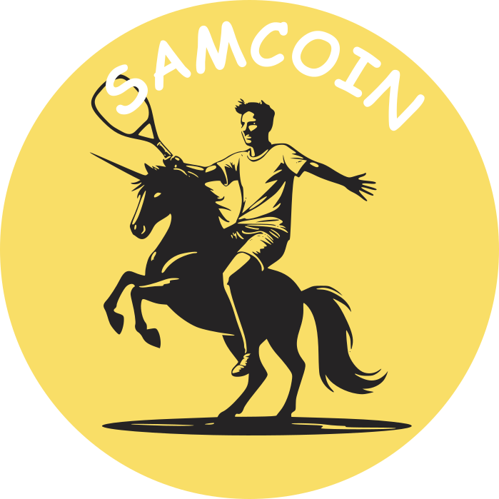

# Samcoin (SAMUEL) Token
## In Honor of the Greatest Padel Player of All Times

Samcoin is a token created to honor Samuel, the greatest padel player of all times. With a fixed supply of 1 billion tokens, Samcoin (SAMUEL) is a unique opportunity to show your appreciation for Samuel's achievements in the sport.

## Key Features

* Fixed supply: 1 billion SAMUEL tokens
* Tradable on Uniswap: [https://app.uniswap.org/explore/tokens/polygon/0x3cdcebedbda0c3ba023a1b331ee0b5a2414420b0](https://app.uniswap.org/explore/tokens/polygon/0x3cdcebedbda0c3ba023a1b331ee0b5a2414420b0)
* Token address: 0x3CDCeBedBDA0C3ba023A1b331ee0b5a2414420B0 (on Polygon)

## Join the Community

Show your support for Samuel and the padel community by acquiring Samcoin tokens. With a strong and dedicated community, we aim to make Samcoin a symbol of excellence in the world of padel.

## Get Started

To start trading Samcoin, visit Uniswap and search for the token address: 0x3CDCeBedBDA0C3ba023A1b331ee0b5a2414420B0. Join the movement and be a part of the Samcoin community today!
